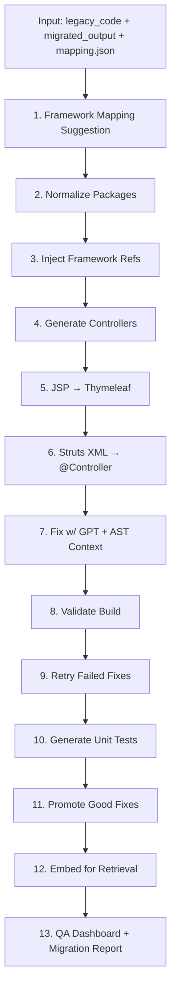

# 🧠 Migration Assist Post-Processor – Full Workflow & Usage Guide

An advanced AI-assisted post-processing tool to finalize and clean up Java application migrations from legacy enterprise frameworks (EJB, JSP, Struts, iBatis) to modern Spring Boot architecture.

---

## 📌 What This Tool Does

You start with:
- A legacy enterprise codebase (e.g., `.ear`, `.war`)
- A partially migrated output (from GPT or Azure OpenAI)

This tool:
- 🔍 Resolves broken references
- 🧠 Fills missing methods using GPT + AST context
- 🛠 Converts JSP → Thymeleaf, Struts XML → Spring MVC
- 🔧 Generates missing controllers/services
- 🧪 Validates build & test generation
- 📡 Embeds and learns from reference examples
- 📊 Offers a QA checklist and audit tracking

---

## 🧱 Key Design Philosophy

| Principle              | Implementation                                      |
|------------------------|------------------------------------------------------|
| Clean, buildable code  | Compiles `.java` files post-fix                      |
| Separation of concerns | Controllers and services split cleanly               |
| DTO architecture       | Promotes `@ModelAttribute` + `@RequestBody` usage    |
| Manual-ready output    | QA dashboard & audit tracking                        |
| Learn from past fixes  | Promotes & embeds successful fixes as examples       |

---

## 🧠 Workflow Overview



---

## 🧭 Best Practice: Handling `.ear` and `.war`

### Step-by-step strategy:

1. ✅ **Migrate `.ear` first**
    - Extract EJBs, shared logic, service layers
    - Promote successful fixes for reuse

2. ✅ **Then migrate `.war`**
    - Fix controllers and JSPs
    - Auto-connect to services from `.ear` phase

3. ✅ Use `--reference-ear` to prioritize `.ear` context during `.war` migration

4. ✅ Review everything in `streamlit` dashboard

---

## 🛠 Commands to Run

### Step 1: Install dependencies

```bash
pip install -r requirements.txt
```

### Step 2: Set `.env`

```env
OPENAI_API_KEY=sk-xxxxxxxxxxxxxxxx
PYTHONPATH=.
```

### Step 3: Suggest framework mappings

```bash
python cli/suggest_framework_mapping.py ^
  --legacy-fw legacy_framework ^
  --springboot-fw springboot_framework ^
  --output config/suggested_framework_mapping.json
```

### Step 4: Migrate `.ear`

```bash
python cli/migrate.py ^
  --legacy legacy_apps/app1.ear ^
  --migrated migrated_apps/app1.ear ^
  --mapping mappings/app1-ear-mapping.json ^
  --reference reference_apps/promoted
```

### Step 5: Migrate `.war`

```bash
python cli/migrate.py ^
  --legacy legacy_apps/app1.war ^
  --migrated migrated_apps/app1.war ^
  --mapping mappings/app1-war-mapping.json ^
  --reference-ear migrated_apps/app1.ear
```

### OR use wrapper:

```bash
migrate_app.bat app1
```

---

## 📄 migration_report.json Explained

Each entry contains:

```json
{
  "filename": "UserController.java",
  "legacy_source_path": "src/legacy/UserAction.java",
  "compilation": "success",
  "qa_checklist": {
    "compiles": true,
    "controller_present": true,
    "service_separated": true,
    "dto_used": true,
    "thymeleaf_ready": true,
    "manual_review_done": false
  },
  "notes": "Uses legacy naming pattern; consider refactor."
}
```

---

## 👁️ Manual QA Checklist

Review each file in the dashboard:

| Checklist Item         | Meaning |
|------------------------|---------|
| ✅ Compiles            | `javac` compiled successfully |
| 🧭 Controller present  | Controller exists for service |
| 🧩 Service separated   | Logic split from controller |
| 📦 DTO used            | DTO instead of raw models |
| 🎨 Thymeleaf ready     | JSP correctly migrated |
| 👁 Manual reviewed     | Developer has reviewed this file |

---

## ⚠️ Manual Intervention Expectations

| Task | Manual Needed? |
|------|----------------|
| Build failure from GPT fix | 🟡 sometimes |
| Complex DTO wiring | 🟡 may require tuning |
| Non-standard JSP tags | ✅ requires human handling |
| Controller/service naming mismatch | ✅ reviewed during QA |

---

## 💡 How This Tool Learns Over Time

- Promotes successful fixes
- Indexes them for future RAG use
- Embeds reference apps (migrated & legacy side-by-side)
- Improves GPT prompt injection via `RAGContextRetrieverAgent`

---

## 🧰 Extend or Customize

| Component | How to Extend |
|-----------|---------------|
| Add new agent | Place file in `agents/` and call from `orchestrator.py` |
| Customize controller style | Update templates in `ServiceToControllerAgent` |
| Override Thymeleaf mapping | Update `JspToThymeleafConverterAgent` regex |
| Audit compliance | Extend `MetadataAgent` to log reviewer + timestamp |

---

## 📎 Outputs

| Path | Content |
|------|---------|
| `logs/fix_history/*.json` | GPT fix attempts |
| `logs/manual_review/*.json` | Reviewer notes |
| `data/migration_report.json` | File-by-file audit |
| `reference_apps/promoted/` | Known good examples |
| `generated_tests/` | GPT-generated JUnit stubs |
| `templates/` | Thymeleaf converted pages |

---

## ✅ Final Checklist Before Delivery

- [ ] `.ear` and `.war` both compiled
- [ ] QA dashboard checklist filled
- [ ] Manual interventions noted
- [ ] DTO/Service/Controller structure confirmed
- [ ] `migration_report.json` archived for audit

---

## 🧠 You're Ready!

```bash
python cli/migrate.py ...
streamlit run ui/qa_dashboard.py
```

Enjoy fast, AI-assisted, architecture-compliant migration — for even your most complex legacy apps 🚀
